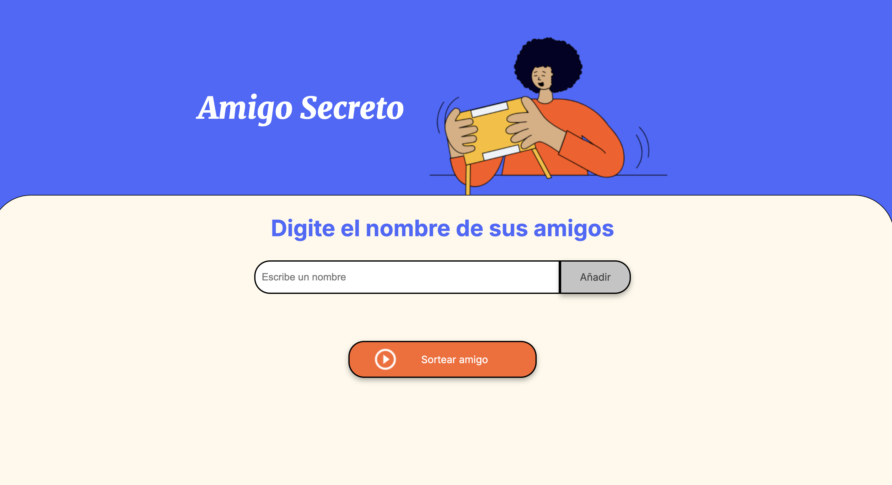

# Amigo Secreto 🎁🥰

¡Una aplicación web para organizar intercambios de regalos secretos de forma divertida y sencilla!
El primer desafío de la ruta de aprendizaje del Curso G8 de Oracle-Alura.



## Características principales ✨
- ✅ Añadir participantes con validación en tiempo real
- ✅ Lista interactiva de participantes
- ✅ Sorteo aleatorio con un solo clic
- ✅ Reinicio automático post-sorteo
- ✅ Diseño responsive y accesible
- ✅ Efectos visuales y feedback claro
- ✅ Compatible con móviles y desktop

## Tecnologías utilizadas 🛠️
- **Frontend**: HTML5, CSS3 (Flexbox, Variables CSS)
- **Fuentes**: Google Fonts (Merriweather e Inter)
- **Lógica**: JavaScript ES6
- **Compatibilidad**: Navegadores modernos (Chrome, Firefox, Safari, Brave)

## Cómo usar 🚀

### Requisitos previos
- Navegador web actualizado
- Conexión a internet (para fuentes Google)

### Instalación
1. Clona el repositorio:
   ```bash
   git clone https://github.com/PakoAraya/alura-amigo-secreto.git
   ```
2. Abre `index.html` en tu navegador

### Flujo de trabajo

#### Agregar participantes:
- Escribe nombres en el campo de texto
- Click en "Añadir" o presiona Enter
- Los nombres aparecerán en la lista

#### Realizar sorteo:
- Verifica la lista de participantes
- Click en el botón "Sortear amigo"
- ¡El ganador aparecerá con animación!

#### Nuevo sorteo:
- El sistema se reinicia automáticamente
- Repite el proceso cuantas veces necesites

## Estructura de archivos 📂
```plaintext
amigo-secreto/
├── assets/
│   ├── css/
│   │   └── style.css
│   ├── img/
│   │   └── amigo-secreto.png
│   └── js/
│       └── app.js
└── index.html
```

## Validaciones clave 🔐
- ✋ Campo vacío al agregar nombre
- ⚠️ Intento de sorteo sin participantes
- ♻️ Limpieza automática de espacios
- 🛑 Reinicio completo post-sorteo

## Personalización 🎨
Modifica en `style.css`:

```css
:root {
    --color-primary: #4B69FD;    /* Color principal */
    --color-secondary: #FFF9EB;  /* Fondo secundario */
    --color-button: #fe652b;     /* Botón principal */
    --color-text: #444444;       /* Texto principal */
}
```

## Mejoras planeadas 🔮
- 📜 Historial de sorteos
- ✉️ Envío de resultados por email
- 🔄 Opción de excluir parejas
- 🌙 Modo oscuro
- 🌎 Internacionalización (multi-idioma)

## Contribuir 🤝
1. Haz fork del proyecto
2. Crea tu rama:
   ```bash
   git checkout -b feature/nueva-funcionalidad
   ```
3. Commit cambios:
   ```bash
   git commit -m 'Descripción del cambio'
   ```
4. Push a la rama:
   ```bash
   git push origin feature/nueva-funcionalidad
   ```
5. Abre un Pull Request

## Licencia 📄
Distribuido bajo licencia MIT. Ver `LICENSE` para más detalles.

❤️ Hecho con ❤️ por [Francisco Javier Araya Hernandez] - ¡Felices fiestas! 🎁
